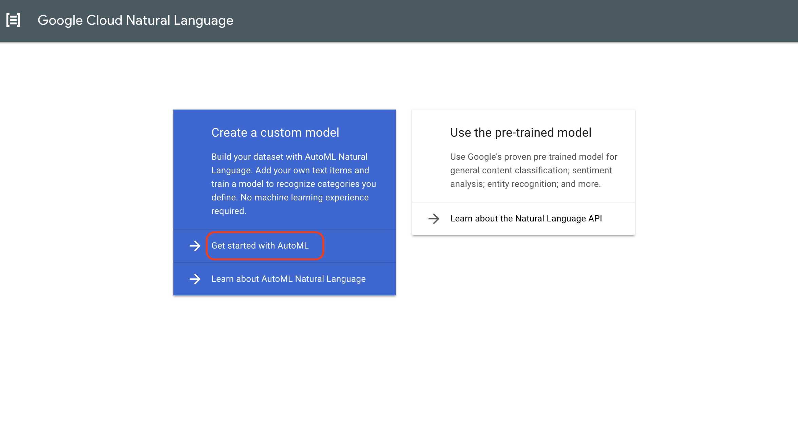
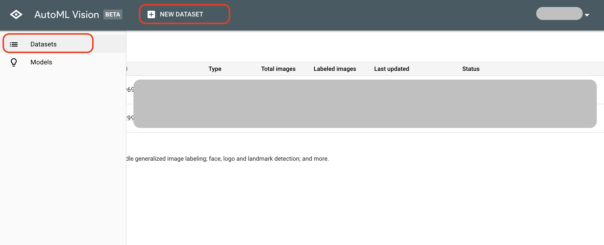
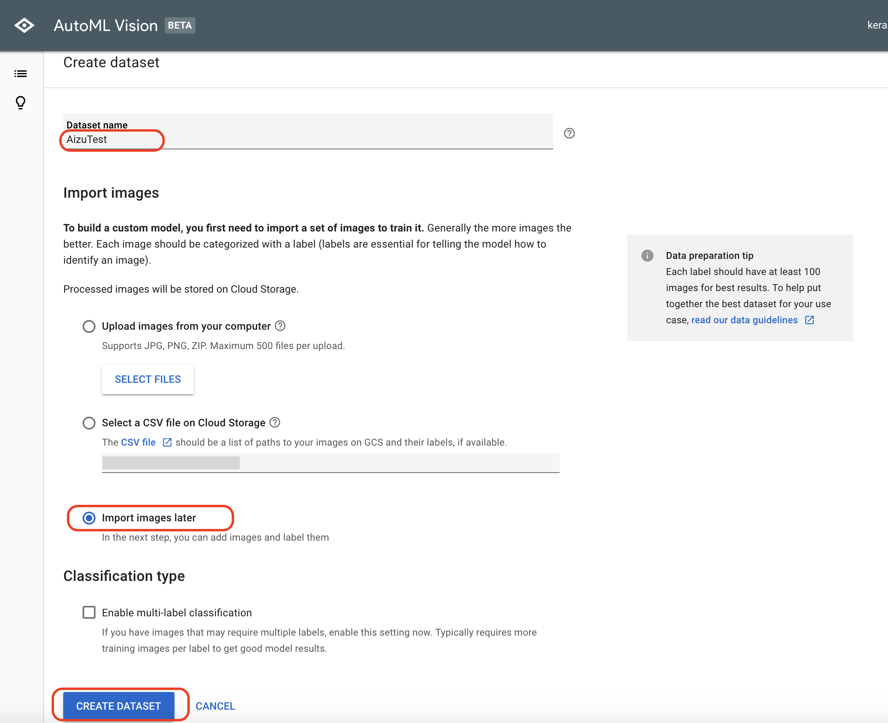
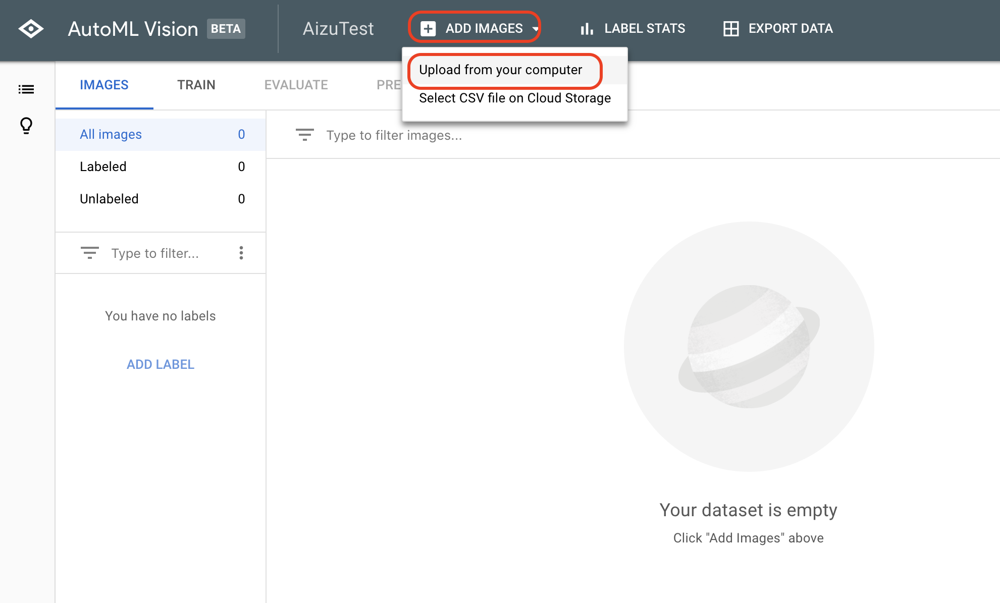

# AutoML

AutoMLは、簡単な処理で独自のモデルが作成できます。現在、[Vision](https://beta-dot-custom-vision.appspot.com/vision/overview), [Translate](https://beta-dot-custom-vision.appspot.com/translation/overview), [Natural Language](https://beta-dot-custom-vision.appspot.com/text/overview)の3つがBeta公開されています。

# AutoML Visionの準備

AutoML Visionを使用するには、料金支払の設定と、APIの有効化が必要です。

[AutoML用プロジェクトの作成](https://console.cloud.google.com/cloud-resource-manager?hl=ja&_ga=2.165375740.-2107046452.1532174868)

[プロジェクトの支払いの有効化](https://console.cloud.google.com/billing)

[AutoML関連 APIの有効化](https://console.cloud.google.com/flows/enableapi?apiid=storage-component.googleapis.com,automl.googleapis.com,storage-api.googleapis.com&hl=ja&_ga=2.165375740.-2107046452.1532174868)

# Datasetの新規作成

# Imageのアップロード

[Aizu Dataset](https://github.com/FaBoPlatform/KerasDocs/raw/master/dataset/dataset_aizu.zip) をダウンロードします。中に、赤べこと起き上がり小法師の画像がはいっています。

