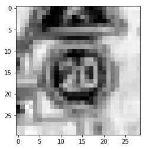
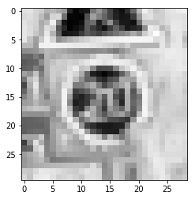
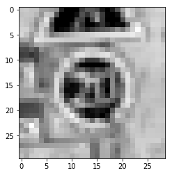

# 3. 色成分の分解

## Rのみ

```python
from matplotlib import pyplot as plt
import cv2

image_path = 'GTSRB/Final_Training/Images/00000/00000_00000.ppm'
image = plt.imread(image_path)
cvt_image = cv2.cvtColor(image, cv2.COLOR_RGB2BGR)
solo_image = cvt_image[:,:,0]
plt.imshow(solo_image, cmap=plt.cm.gray_r,); 
plt.show()
```



## Gのみ

```python
from matplotlib import pyplot as plt
import cv2

image_path = 'GTSRB/Final_Training/Images/00000/00000_00000.ppm'
image = plt.imread(image_path)
cvt_image = cv2.cvtColor(image, cv2.COLOR_RGB2BGR)
solo_image = cvt_image[:,:,1]
plt.imshow(solo_image, cmap=plt.cm.gray_r,); 
plt.show()
```



## Bのみ

```python
from matplotlib import pyplot as plt
import cv2

image_path = 'GTSRB/Final_Training/Images/00000/00000_00000.ppm'
image = plt.imread(image_path)
cvt_image = cv2.cvtColor(image, cv2.COLOR_RGB2BGR)
solo_image = cvt_image[:,:,2]
plt.imshow(solo_image, cmap=plt.cm.gray_r,); 
plt.show()
```

