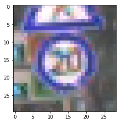
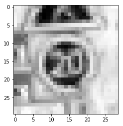
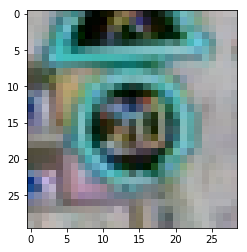
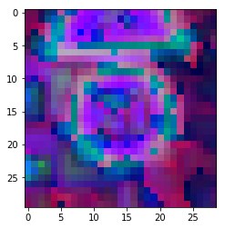
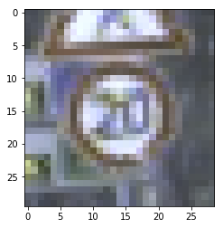
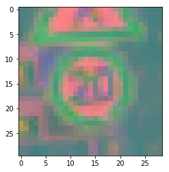

# 4.Color spaces

## RGB2BGR

```python
from matplotlib import pyplot as plt
import cv2

image_path = 'GTSRB/Final_Training/Images/00000/00000_00000.ppm'
image = plt.imread(image_path)
cvt_image = cv2.cvtColor(image, cv2.COLOR_RGB2BGR)
plt.imshow(cvt_image, cmap=plt.cm.gray_r,); 
plt.show()
```



## RGB2GRAY

```python
from matplotlib import pyplot as plt
import cv2

image_path = 'GTSRB/Final_Training/Images/00000/00000_00000.ppm'
image = plt.imread(image_path)
cvt_image = cv2.cvtColor(image, cv2.COLOR_RGB2GRAY)
plt.imshow(cvt_image, cmap=plt.cm.gray_r,); 
plt.show()
```



## RGB2HLS

```python
from matplotlib import pyplot as plt
import cv2

image_path = 'GTSRB/Final_Training/Images/00000/00000_00000.ppm'
image = plt.imread(image_path)
cvt_image = cv2.cvtColor(image, cv2.COLOR_RGB2HLS)
plt.imshow(cvt_image, cmap=plt.cm.gray_r,); 
plt.show()
```




## RGB2HSV

```python
from matplotlib import pyplot as plt
import cv2

image_path = 'GTSRB/Final_Training/Images/00000/00000_00000.ppm'
image = plt.imread(image_path)
cvt_image = cv2.cvtColor(image, cv2.COLOR_RGB2HSV)
plt.imshow(cvt_image, cmap=plt.cm.gray_r,); 
plt.show()
```



## RGB2XYZ

```python
from matplotlib import pyplot as plt
import cv2

image_path = 'GTSRB/Final_Training/Images/00000/00000_00000.ppm'
image = plt.imread(image_path)
cvt_image = cv2.cvtColor(image, cv2.COLOR_RGB2XYZ)
plt.imshow(cvt_image, cmap=plt.cm.gray_r,); 
plt.show()
```



## RGB2HLS

```python
from matplotlib import pyplot as plt
import cv2

image_path = 'GTSRB/Final_Training/Images/00000/00000_00000.ppm'
image = plt.imread(image_path)
cvt_image = cv2.cvtColor(image, cv2.COLOR_RGB2HLS)
plt.imshow(cvt_image, cmap=plt.cm.gray_r,); 
plt.show()
```


## RGB2YUV

```python
from matplotlib import pyplot as plt
import cv2

image_path = 'GTSRB/Final_Training/Images/00000/00000_00000.ppm'
image = plt.imread(image_path)
cvt_image = cv2.cvtColor(image, cv2.COLOR_RGB2YUV)
plt.imshow(cvt_image, cmap=plt.cm.gray_r,); 
plt.show()
```



## 反転

```python
from matplotlib import pyplot as plt
import cv2

image_path = 'GTSRB/Final_Training/Images/00000/00000_00000.ppm'
image = plt.imread(image_path)
cvt_image = cv2.bitwise_not(image)
plt.imshow(cvt_image, cmap=plt.cm.gray_r,); 
plt.show()
```


