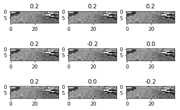

# End2End Emulator

## 教師データ

https://github.com/ymshao/End-to-End-Learning-for-Self-Driving-Cars に公開されているエミュレータにより教師データを作成。


driving_log.csv
```csv
center,left,right,steering,throttle,brake,speed
IMG/center_2016_12_01_13_30_48_287.jpg, IMG/left_2016_12_01_13_30_48_287.jpg, IMG/right_2016_12_01_13_30_48_287.jpg, 0, 0, 0, 22.14829
IMG/center_2016_12_01_13_30_48_404.jpg, IMG/left_2016_12_01_13_30_48_404.jpg, IMG/right_2016_12_01_13_30_48_404.jpg, 0, 0, 0, 21.87963
IMG/center_2016_12_01_13_31_12_937.jpg, IMG/left_2016_12_01_13_31_12_937.jpg, IMG/right_2016_12_01_13_31_12_937.jpg, 0, 0, 0, 1.453011
IMG/center_2016_12_01_13_31_13_037.jpg, IMG/left_2016_12_01_13_31_13_037.jpg, IMG/right_2016_12_01_13_31_13_037.jpg, 0, 0, 0, 1.438419
```


## データのアップロード

IMGフォルダと、driving_log.csvをZIPに固めてJupyterにアップする。

## データの読み込み

```python
import csv
from matplotlib import pyplot as plt

def load_data():
    folder_path = ''
    center_img = []
    direction_handle = []

    f = open(folder_path + 'driving_log.csv', 'r')

    reader = csv.reader(f)
    header = next(reader)
    for row in reader:
        img_name = row[0]
        img_path = folder_path  +  img_name
        img = plt.imread(img_path)
        center_img.append(img)
        direction_handle.append(float(row[3]))
    f.close()
    
    return (center_img, direction_handle)
```

> (center_img, direction_handle) = load_data()

## データの増幅

deltaだけ左右にずらしたハンドルの角度と中心画像で、3倍のデータに増やす。

```python
def grow_data(center_img, direction_handle, delta):
    new_center = []
    new_direction = []
    for i in range(len(center_img)):
        for j in range(3):
            new_center.append(features[i])
            if j == 0:
                new_direction.append(direction_handle[i])
            elif j == 1:
                new_direction.append(direction_handle[i] + float(delta))
            elif j == 2:
                new_direction.append(direction_handle[i] - float(delta))
    return (new_center,  new_direction)
```

> delta = 0.2
> (center_img, direction_handle) = grow_data(center_img, direction_handle, delta)

## 画像処理

Cropで範囲を区切り、色空間の変換とR,G,Bのいずれか1色を取得する。

```python
import cv2

def process_img(center_img):
    new_center = []
    for img in center_img:
        crop_img = img[60:140, 0:320, :]
        resize_img = cv2.resize((cv2.cvtColor(crop_img, cv2.COLOR_RGB2BGR))[:,:,0],(40,10))
        new_center.append(resize_img)
        
    return new_center    
```

> center_data = process_img(center_img)

## 確認

画像を表示して確認

```python
def draw_img(center_img, direction_handle, pos=0):
    g_rows = 3
    g_cols = 3
    size = g_rows * g_cols
    fig, axs = plt.subplots(ncols=g_rows, nrows=size/g_rows)

    for h in range(g_rows):
        for i in range(g_cols):
            axs[h][i].imshow(center_img[pos + i * h], cmap=plt.cm.gray_r,) 
            axs[h][i].set_title(str(direction_handle[pos + h * i]))
    plt.show()
```

> draw_img(center_data, direction_handle, 50)


