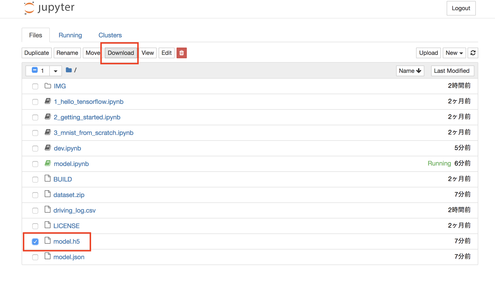
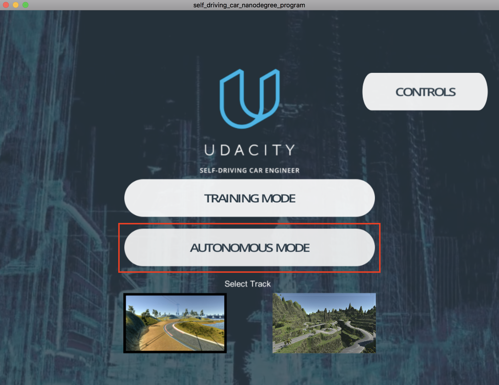

## Local環境の構築(MAC)

```
pip install opencv-python
pip install socketio
pip install Image
pip install keras
pip install Flask
pip install tensorflow
```

## 学習済みModelのDownload




## 実行ソース

https://github.com/ymshao/End-to-End-Learning-for-Self-Driving-Cars/blob/master/drive.py

より


drive.py
```python
import argparse
import base64
import json
import cv2

import numpy as np
import socketio
import eventlet
import eventlet.wsgi
import time
from PIL import Image
from PIL import ImageOps
from flask import Flask, render_template
from io import BytesIO

from keras.models import model_from_json
from keras.preprocessing.image import ImageDataGenerator, array_to_img, img_to_array

# Fix error with Keras and TensorFlow
import tensorflow as tf
tf.python.control_flow_ops = tf


sio = socketio.Server()
app = Flask(__name__)
model = None
prev_image_array = None

@sio.on('telemetry')
def telemetry(sid, data):
    # The current steering angle of the car
    steering_angle = data["steering_angle"]
    # The current throttle of the car
    throttle = data["throttle"]
    # The current speed of the car
    speed = data["speed"]
    # The current image from the center camera of the car
    imgString = data["image"]
    image = Image.open(BytesIO(base64.b64decode(imgString)))
    image_array = np.asarray(image)
    transformed_image_array = image_array[None, :, :, :]

    #resize the image
    transformed_image_array = ( cv2.resize((cv2.cvtColor(transformed_image_array[0], cv2.COLOR_RGB2HSV))[:,:,1],(32,16))).reshape(1,16,32,1)
    
    # This model currently assumes that the features of the model are just the images. Feel free to change this.
    steering_angle = float(model.predict(transformed_image_array, batch_size=1))
    # The driving model currently just outputs a constant throttle. Feel free to edit this.
    throttle = 0.2
    #adaptive speed
    '''
    if (float(speed) < 10):
        throttle = 0.4 
    else:
        # When speed is below 20 then increase throttle by speed_factor
        if ((float(speed)) < 25):
            speed_factor = 1.35
        else:
            speed_factor = 1.0 
        if (abs(steering_angle) < 0.1): 
            throttle = 0.3 * speed_factor
        elif (abs(steering_angle) < 0.5):
            throttle = 0.2 * speed_factor
        else:
            throttle = 0.15 * speed_factor
    '''
    print('Steering angle =', '%5.2f'%(float(steering_angle)), 'Throttle =', '%.2f'%(float(throttle)), 'Speed  =', '%.2f'%(float(speed)))
    send_control(steering_angle, throttle)


@sio.on('connect')
def connect(sid, environ):
    print("connect ", sid)
    send_control(0, 0)


def send_control(steering_angle, throttle):
    sio.emit("steer", data={
    'steering_angle': steering_angle.__str__(),
    'throttle': throttle.__str__()
    }, skip_sid=True)


if __name__ == '__main__':
    parser = argparse.ArgumentParser(description='Remote Driving')
    parser.add_argument('model', type=str,
    help='Path to model definition json. Model weights should be on the same path.')
    args = parser.parse_args()
    with open(args.model, 'r') as jfile:
        # NOTE: if you saved the file by calling json.dump(model.to_json(), ...)
        # then you will have to call:
        #
        #   model = model_from_json(json.loads(jfile.read()))\
        #
        # instead.
        model = model_from_json(jfile.read())


    model.compile("adam", "mse")
    weights_file = args.model.replace('json', 'h5')
    model.load_weights(weights_file)

    # wrap Flask application with engineio's middleware
    app = socketio.Middleware(sio, app)

    # deploy as an eventlet WSGI server
    eventlet.wsgi.server(eventlet.listen(('', 4567)), app)
```


## エミュレーターの起動




## AIの実行

> python drive.py model.json

