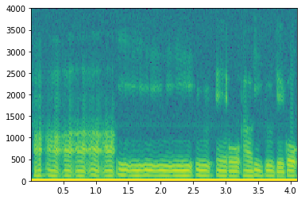

# スペクトラグラム

## グラフを表示

```python
import matplotlib.pyplot as plt
import librosa

wave, rate = librosa.load("sample.wav")
spec = plt.specgram(wave, Fs = rate)
```


```python
import scipy.io.wavfile as wio
import matplotlib.pyplot as plt

rate, data = wio.read("sample_solo.wav")
spec = plt.specgram(data, Fs = rate)
```



## 画像を保存

```python
import scipy.io.wavfile as wio
import matplotlib.pyplot as plt

rate, data = wio.read("sample_solo.wav")
spec = plt.specgram(data, Fs = rate)
plt.axis('off')
plt.savefig('specrtum_solo.png', bbox_inches='tight', dpi=50, frameon='false')

```