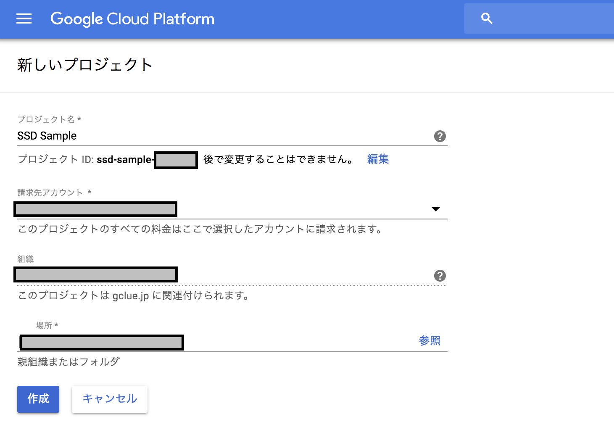

# GCPの設定

## GCP

### Projectの作成

https://console.cloud.google.com/projectcreate
からプロジェクトを作成する。



### 支払いの有効化

TPUは基本有料なので、支払いのアカウント設定をおこなう


### Cloud Machine Learning Engine ComputeのAPI有効化

https://console.cloud.google.com/flows/enableapi?apiid=ml.googleapis.com,compute_component

からCloud Machine Learning Engine ComputeのAPIを有効化する


### ローカルにDockerのインストール

> $ docker run -it -p 8888:8888 tensorflow/tensorflow 

### Google Cloud SDKのインストール

起動したDockerにログインする

```shell
$ docker ps
CONTAINER ID        IMAGE                   COMMAND                  CREATED             STATUS              PORTS                              NAMES
349f71072537        tensorflow/tensorflow   "/run_jupyter.sh --a…"   2 weeks ago         Up 3 days           6006/tcp, 0.0.0.0:8888->8888/tcp   keen_euclid
```

```shell
$ docker exec -it 349f71072537 /bin/bash
```

Google Cloud SDK を https://cloud.google.com/sdk/docs/quickstart-debian-ubuntu からダウンロードして、docker内にインストールする。

docker内で実行
```shell
$ export CLOUD_SDK_REPO="cloud-sdk-$(lsb_release -c -s)" && \
    echo "deb http://packages.cloud.google.com/apt $CLOUD_SDK_REPO main" | tee -a /etc/apt/sources.list.d/google-cloud-sdk.list && \
    curl https://packages.cloud.google.com/apt/doc/apt-key.gpg | apt-key add - && \
    apt-get update -y && apt-get install google-cloud-sdk -y
```

### プロジェクトの設定

GCPのホームに戻り、プロジェクトIDをコピーしてくる。


プロジェクトIDを指定して、configを実行

docker内で実行
```shell
$ gcloud config set project "プロジェクトID"
```

### バケットの作成

docker内で実行
```shell
$ gcloud auth login
```

で、GCPとDocker間でのログイン認証をおこなう。

データ等をおくバケットを作成する。

docker内で実行
```shell
$ gsutil mb gs://バケット名
```

### 環境変数の整備

docker内で実行
```shell
$ export PROJECT="プロジェクトID"
$ export YOUR_GCS_BUCKET="バケット名"
```

docker内で実行
```shell
$ curl -H "Authorization: Bearer $(gcloud auth print-access-token)"  \
https://ml.googleapis.com/v1/projects/${PROJECT}:getConfig
```

```shell
{
  "serviceAccount": "service-###########@cloud-ml.google.com.iam.gserviceaccount.com",
  "serviceAccountProject": "#############"
  "config": {
    "tpuServiceAccount": "service-##########.iam.gserviceaccount.com"
  }
}
```

docker内で実行
```shell
$ export TPU_ACCOUNT="tpuServiceAccountの値"
```


docker内で実行
```shell
$ gcloud projects add-iam-policy-binding $PROJECT  \
    --member serviceAccount:$TPU_ACCOUNT --role roles/ml.serviceAgent
```

member情報がでてくれば、成功。
