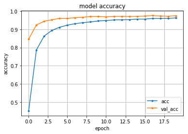

# 信号認識

## Dataset

> !wget http://benchmark.ini.rub.de/Dataset/GTSRB_Final_Training_Images.zip

> !unzip GTSRB_Final_Training_Images.zip

## OpenCVのパッケージをいれる

> !apt-get update
> !apt-get -y install python-opencv

## Model

```python
from __future__ import print_function
import keras
from keras.datasets import mnist
from keras.models import Sequential
from keras.layers import Dense, Dropout, Flatten
from keras.layers import Conv2D, MaxPooling2D
from keras import backend as K
import cv2
import csv
from matplotlib import pyplot as plt
import random
import numpy as np
from sklearn.utils import shuffle
from sklearn.model_selection import train_test_split
from keras.optimizers import Adam

batch_size = 128
num_classes = 42
epochs = 20

rows, cols = 25, 25

labels = []
features = []


for i in range(42):
    logs = []
    if i < 10:
        file_path = 'GTSRB/Final_Training/Images/0000' + str(i) 
        file_name = file_path + '/GT-0000' + str(i) + '.csv'
    elif i < 100:
        file_path = 'GTSRB/Final_Training/Images/000' + str(i) 
        file_name = file_path + '/GT-000' + str(i) + '.csv'

    with open(file_name,'rt') as file:
        reader = csv.reader(file, delimiter=";", doublequote=True, lineterminator="\r\n", quotechar='"', skipinitialspace=True)
        for line in reader:
            logs.append(line)
        log_labels = logs.pop(0)

    for i in range(len(logs)):
        img_name = logs[i][0]
        img_path = file_path + '/' +  img_name
        img = plt.imread(img_path)
        #resized = cv2.resize((cv2.cvtColor(img, cv2.COLOR_RGB2XYZ))[:,:,1],(cols,rows))
        resized = cv2.resize(img, (cols,rows))
        
        
        features.append(resized)
        labels.append(int(logs[i][7]))
        
features = np.array(features).astype('float32')
labels = np.array(labels).astype('float32')

features = np.append(features,features[:,:,::-1],axis=0)
labels = np.append(labels,-labels,axis=0)

features, labels = shuffle(features, labels)

train_features, test_features, train_labels, test_labels = train_test_split(features, labels, random_state=0, test_size=0.1)

#reshape the data  to feed into the network
train_features = train_features.reshape(train_features.shape[0], rows, cols, 1)
test_features = test_features.reshape(test_features.shape[0], rows, cols, 1)

train_labels = keras.utils.to_categorical(train_labels, num_classes)
test_labels = keras.utils.to_categorical(test_labels, num_classes)

model = Sequential()
model.add(Conv2D(32, kernel_size=(3, 3), activation='relu', input_shape=(rows, cols, 1)))
model.add(Conv2D(64, (3, 3), activation='relu'))
model.add(MaxPooling2D(pool_size=(2, 2)))
model.add(Dropout(0.25))
model.add(Flatten())
model.add(Dense(128, activation='relu'))
model.add(Dropout(0.5))
model.add(Dense(num_classes, activation='softmax'))
model.summary()

model.compile(loss=keras.losses.categorical_crossentropy,
              optimizer=keras.optimizers.Adadelta(),
              metrics=['accuracy'])

history = model.fit(train_features, train_labels, 
          batch_size=batch_size, 
          epochs=epochs, 
          verbose=1, 
          validation_data=(test_features, test_labels))
```

## 結果

```
Train on 70144 samples, validate on 7794 samples
Epoch 1/20
70144/70144 [==============================] - 121s 2ms/step - loss: 2.4245 - acc: 0.4524 - val_loss: 0.6344 - val_acc: 0.8467
Epoch 2/20
70144/70144 [==============================] - 112s 2ms/step - loss: 0.7349 - acc: 0.7871 - val_loss: 0.2587 - val_acc: 0.9244
Epoch 3/20
70144/70144 [==============================] - 110s 2ms/step - loss: 0.4527 - acc: 0.8630 - val_loss: 0.2018 - val_acc: 0.9443
Epoch 4/20
70144/70144 [==============================] - 111s 2ms/step - loss: 0.3452 - acc: 0.8942 - val_loss: 0.1557 - val_acc: 0.9528
Epoch 5/20
70144/70144 [==============================] - 115s 2ms/step - loss: 0.2877 - acc: 0.9116 - val_loss: 0.1373 - val_acc: 0.9604
Epoch 6/20
70144/70144 [==============================] - 110s 2ms/step - loss: 0.2498 - acc: 0.9231 - val_loss: 0.1341 - val_acc: 0.9598
Epoch 7/20
70144/70144 [==============================] - 114s 2ms/step - loss: 0.2223 - acc: 0.9314 - val_loss: 0.1230 - val_acc: 0.9642
Epoch 8/20
70144/70144 [==============================] - 119s 2ms/step - loss: 0.2062 - acc: 0.9366 - val_loss: 0.1095 - val_acc: 0.9666
Epoch 9/20
70144/70144 [==============================] - 119s 2ms/step - loss: 0.1904 - acc: 0.9410 - val_loss: 0.1064 - val_acc: 0.9707
Epoch 10/20
70144/70144 [==============================] - 115s 2ms/step - loss: 0.1743 - acc: 0.9462 - val_loss: 0.1030 - val_acc: 0.9706
Epoch 11/20
70144/70144 [==============================] - 108s 2ms/step - loss: 0.1677 - acc: 0.9483 - val_loss: 0.1135 - val_acc: 0.9687
Epoch 12/20
70144/70144 [==============================] - 111s 2ms/step - loss: 0.1562 - acc: 0.9518 - val_loss: 0.1033 - val_acc: 0.9713
Epoch 13/20
70144/70144 [==============================] - 112s 2ms/step - loss: 0.1540 - acc: 0.9524 - val_loss: 0.1031 - val_acc: 0.9718
Epoch 14/20
70144/70144 [==============================] - 108s 2ms/step - loss: 0.1495 - acc: 0.9535 - val_loss: 0.1079 - val_acc: 0.9706
Epoch 15/20
70144/70144 [==============================] - 107s 2ms/step - loss: 0.1426 - acc: 0.9564 - val_loss: 0.1010 - val_acc: 0.9716
Epoch 16/20
70144/70144 [==============================] - 107s 2ms/step - loss: 0.1414 - acc: 0.9563 - val_loss: 0.1018 - val_acc: 0.9729
Epoch 17/20
70144/70144 [==============================] - 111s 2ms/step - loss: 0.1320 - acc: 0.9596 - val_loss: 0.0968 - val_acc: 0.9759
Epoch 18/20
70144/70144 [==============================] - 108s 2ms/step - loss: 0.1318 - acc: 0.9597 - val_loss: 0.1028 - val_acc: 0.9732
Epoch 19/20
70144/70144 [==============================] - 109s 2ms/step - loss: 0.1304 - acc: 0.9604 - val_loss: 0.1061 - val_acc: 0.9723
Epoch 20/20
70144/70144 [==============================] - 110s 2ms/step - loss: 0.1252 - acc: 0.9626 - val_loss: 0.1021 - val_acc: 0.9751
```

## グラフ

```python
from matplotlib import pyplot as plt

# 精度のplot
plt.plot(history.history['acc'], marker='.', label='acc')
plt.plot(history.history['val_acc'], marker='.', label='val_acc')
plt.title('model accuracy')
plt.grid()
plt.xlabel('epoch')
plt.ylabel('accuracy')
plt.legend(loc='best')
plt.show()
```



## 評価

```python
score = model.evaluate(test_features, test_labels, verbose=0)
print('Test loss:', score[0])
print('Test accuracy:', score[1])
```

```
Test loss: 0.10212556134359667
Test accuracy: 0.9751090582652309
```


